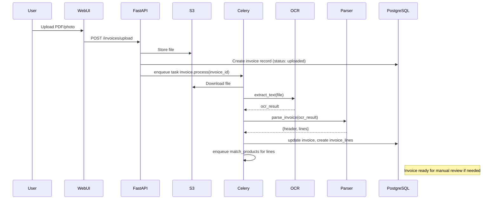
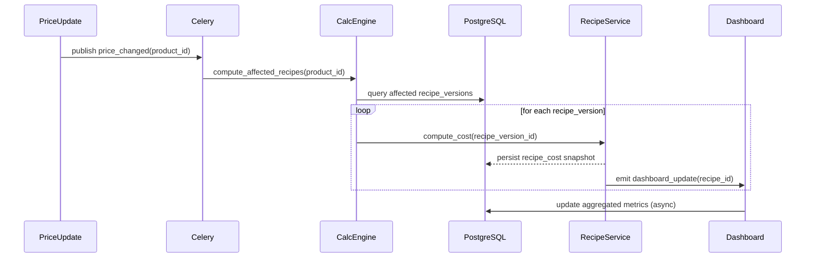
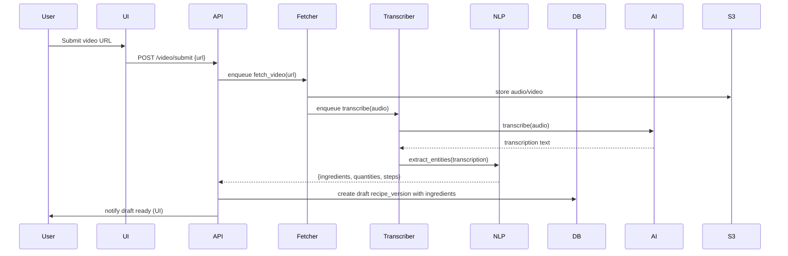

# Diagrammes Mermaid — Architecture & séquences

## Architecture globale
```mermaid
flowchart TD
  subgraph Clients
    A[Next.js Web UI]
    B[Flutter Mobile App]
  end

  subgraph API
    G[FastAPI Backend (API Gateway)]
  end

  subgraph Services
    OCR[OCR Service]
    AI[AI Service (RAG, LLM)]
    CAT[Catalog Service]
    INV[Invoice Parser Service]
    REC[Recipe Service]
    CALC[Calculation Engine]
    TRANS[Video/Transcription Service]
    WORKERS[Celery Workers]
  end

  subgraph Infra
    PG[(PostgreSQL)]
    REDIS[(Redis)]
    S3[(S3-compatible Storage)]
    ES[(OpenSearch/Elasticsearch)]
    OBJ[(Object Storage)]
  end

  A -->|REST / GraphQL| G
  B -->|REST / GraphQL| G
  G --> CAT
  G --> INV
  G --> REC
  G --> AI
  G --> TRANS
  G --> WORKERS

  INV -->|store file| S3
  INV -->|enqueue OCR job| WORKERS
  WORKERS --> OCR
  OCR -->|ocr result| S3
  OCR --> INV

  WORKERS --> CALC
  CALC --> REC
  CALC --> PG

  AI -->|embeddings| PG
  TRANS -->|audio| S3
  TRANS --> AI

  G --> PG
  G --> REDIS
  G --> ES

  style G fill:#f9f,stroke:#333,stroke-width:1px
```

## Sequence: Importer une facture


## Sequence: Changement de prix -> Recalcul recettes


## Sequence: Ingestion vidéo -> création brouillon recette

